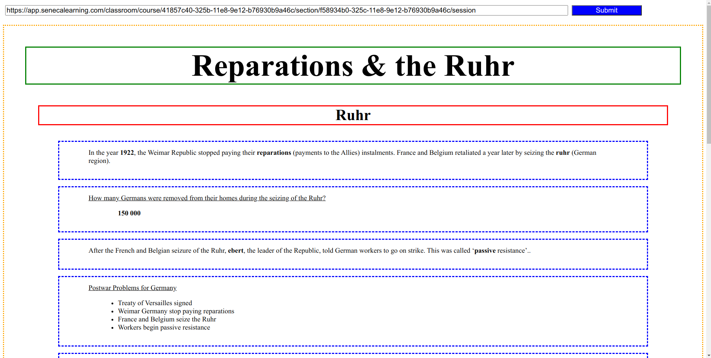

# Seneca cheat sheet generator

As a fun exercise, I made this cheat sheet generator for Seneca. Simply input the session url and it'll generate  the
answers.

Please note that it will not contain all the answers, as Seneca does reuse questions from the previous section.
This has been created for curiosity only, I do not condone cheating in any way, shape or form on your Seneca homework.
It is an important part of your learning.

Credit to [IsGabriellaCurious](https://github.com/IsGabriellaCurious) for her C# tool
[SenecaCheatSheet](https://github.com/IsGabriellaCurious/SenecaCheatSheet) for figuring out the method to fetch answers.
